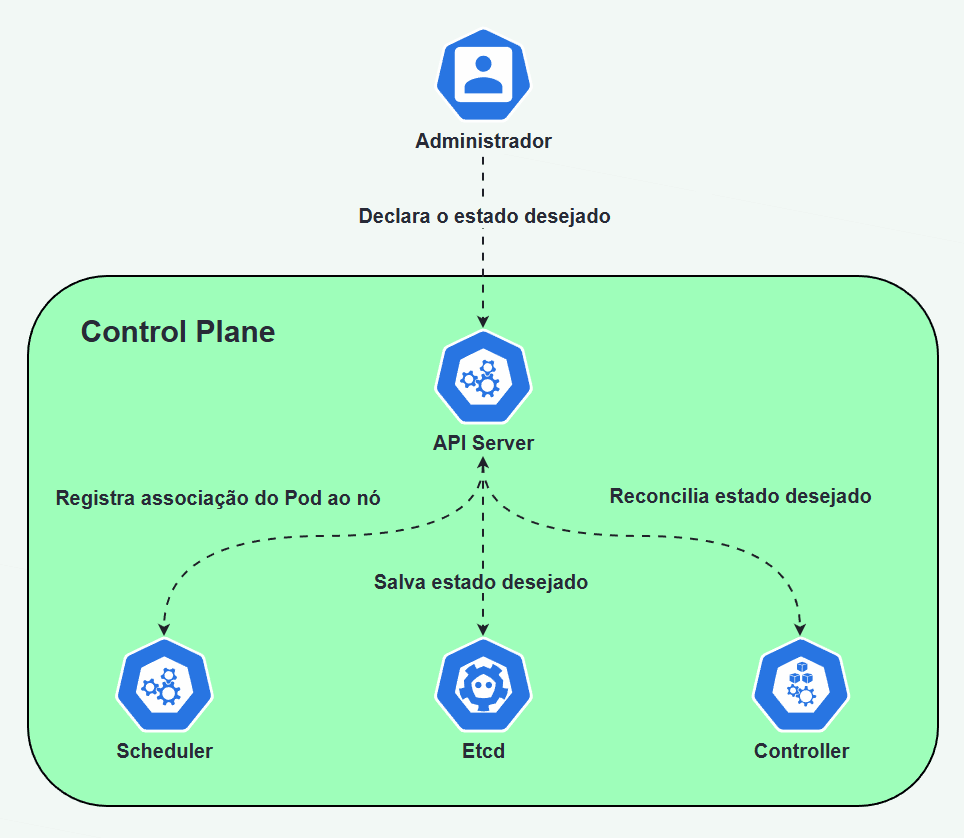

---
quiz:
  auto_number: true
  shuffle_answers: true
---

# Control Plane do Kubernetes

## Contexto

Sabemos que o Kubernetes mantém aplicações através de **loops de reconciliação executados por controllers independentes**, contudo, uma dúvida que pode surgir é:

Quem de fato está no controle do cluster? Será que existe algum processo central tomando todas as decisões?

A resposta pode parecer surpreendente, mas o Kubernetes não possui um único processo central coordenando tudo. Em vez disso, ele funciona como um sistema de controle distribuído.

Cada componente observa o estado do cluster, compara com o estado desejado e toma ações quando necessário.

A coordenação acontece de forma indireta, através de um ponto comum onde o estado do cluster é registrado e observado.

Esse conjunto de componentes forma o que chamamos de Control Plane.

É ele que mantém a visão do cluster e permite que vários controllers trabalhem de forma independente, mas ainda assim convergindo para o mesmo objetivo: o estado desejado.

Para entender melhor como essa coordenação acontece na prática, podemos visualizar o fluxo de funcionamento do Control Plane:



Perceba que não existe um "cérebro central" tomando decisões.

Cada componente observa mudanças no estado do cluster e reage de forma independente, sempre convergindo para o estado desejado.

---

## O que é o Control Plane

O **Control Plane** é o conjunto de componentes responsáveis por controlar o comportamento do cluster.

Ele mantém a visão global do ambiente e garante que a configuração declarada pelos operadores seja respeitada.

Entre suas principais responsabilidades estão:

- receber requisições da API
- armazenar o estado do cluster
- observar mudanças nos recursos
- executar loops de reconciliação
- decidir onde workloads devem rodar

De forma simplificada, o Control Plane funciona como o **sistema de controle do Kubernetes**.

Ele decide **o que deve acontecer**, enquanto outros componentes do cluster executam essas decisões.

### Componentes do Control Plane

O Control Plane é composto por vários processos independentes que cooperam para manter o cluster funcionando.

Os principais componentes são:

- **API Server**
- **Storage**
- **Scheduler**
- **Controller Manager**

Cada componente possui responsabilidades específicas dentro da arquitetura do Kubernetes.

---

## API Server

Nesse ponto, já sabemos que o Kubernetes não possui um coordenador central.

Vários componentes trabalham de forma independente, observando e reagindo ao estado do cluster.

Mas isso levanta uma pergunta fundamental, **como todos esses componentes enxergam o mesmo estado do sistema?**

A resposta está no **API Server**, o ponto central de comunicação do Kubernetes.

Toda comunicação dentro do cluster passa por ele, tanto de usuários quanto dos próprios componentes internos.

Quando você executa:

```bash
kubectl apply -f deployment.yaml
```

Você não está falando diretamente com o cluster, na prática, você está enviando uma requisição HTTP para o API Server.

Esse componente expõe uma API Rest onde enviamos arquivos de configuração em YAML chamados de manifestos (manifests).

Esses arquivos descrevem o estado desejado da aplicação, como:

- qual imagem de container usar
- quantas réplicas de Pod devem existir
- quais portas devem ser expostas

Quando recebe essa requisição, o API Server:

1. autentica e autoriza a chamada
2. valida a configuração enviada
3. persiste o estado no armazenamento do cluster
4. permite que outros componentes observem essa mudança

A partir daí, outros componentes começam a agir para tornar o estado real igual ao estado desejado (loop de reconciliação).

---

## Storage (etcd)

O **Storage** é o componente responsável por guardar tudo o que o cluster sabe. Ele é a fonte da verdade do estado do cluster.

É nele que ficam informações como:

- qual é o estado desejado do cluster
- o que está rodando agora
- quais são as configurações do cluster

Hoje, essa função é desempenhada pelo etcd, um banco de dados distribuído do tipo **key-value store**.

O Kubernetes é formado por vários componentes independentes e nenhum deles resolve tudo sozinho.

Mas o etcd tem um papel diferente dos demais, ele é quem persiste o estado que todos os outros usam.

Por essa razão, em ambientes produtivos, é fundamental tratar o cluster com atenção especial:

- múltiplas réplicas (3-5 em produção)
- alta disponibilidade
- estratégias de backup

A essa altura você pode estar se perguntando "O que ocorre se houver algum problema no Storage?"

Na prática, as aplicações continuam rodando, mas o cluster pode parar de aceitar mudanças.

Ou seja:

- sem novos deploys
- sem escala
- sem atualizações

Isso ocorre porque ele prioriza consistência, o sistema prefere "não mudar" do que correr o risco de inconsistência no estado.

Um detalhe técnico importante sobre o etcd é que ele não armazena apenas o estado, mas também garante consistência forte entre os nós.

Isso significa que toda escrita precisa passar por consenso (via algoritmo RAFT), com um líder coordenando as mudanças.

Na prática, **leituras podem ser rápidas, mas escritas dependem do quorum**.

Por conta disso, a latência entre os nós do etcd impacta diretamente o cluster. É também o motivo pelo qual ambientes multi-região para o etcd exigem bastante cuidado.

Em suma:

Todos os componentes do Control Plane observam esse estado através do API Server.

Isso permite que controllers operem de forma independente, mas ainda assim compartilhem uma visão consistente do sistema.

Devido à sua importância, o etcd é considerado **um dos componentes mais críticos da arquitetura do Kubernetes**.

Se o armazenamento do cluster for comprometido, o Control Plane perde a capacidade de coordenar o sistema.

---

## Scheduler

O **Scheduler** (kube-scheduler) é responsável por decidir **onde cada Pod será executado dentro do cluster**.

Ele não cria Pods e nem executa containers, ele apenas decide onde rodar.

Na prática, funciona assim

1. um novo Pod é criado
2. ele é registrado no cluster sem node definido
3. o scheduler observa esse Pod
4. o scheduler seleciona um node apropriado
5. o Pod recebe uma atribuição de execução

A decisão não é aleatória, antes de decidir o Scheduler precisa responder a seguinte pergunta:

- Esse node consegue rodar esse Pod?

Com isso, ele começa eliminando nodes que não atendem aos requisitos:

- falta de CPU ou memória
- regras de afinidade e anti-afinidade
- restrições de scheduling
- políticas definidas pelo operador
- portas indisponíveis

Nodes que não servem são descartados.

Depois disso, entra a próxima etapa:

- Entre os nodes válidos, qual é o melhor?

O Scheduler então ranqueia os nodes com base em critérios como:

- recursos disponíveis
- quantidade de workloads rodando
- afinidade com outros Pods
- presença da imagem do container em cache

Então o node com maior pontuação é escolhido.

E se nenhum node for adequado?

Então o Pod não é agendado e fica em estado **Pending**.

Em suma, o Scheduler não é "inteligente", ele é determinístico baseado em regras.

O scheduler não executa workloads diretamente, ele não "move" o Pod para o node, apenas registra a decisão no API Server.

A partir daí, o Worker Node escolhido observa essa mudança e inicia a execução.

Ou seja:

- O Scheduler decide
- O Worker Node executa

Essa separação é o que permite ao Kubernetes escalar e manter os componentes desacoplados.

---

## Controller Manager

Até aqui, vimos que o Kubernetes funciona como um sistema distribuído baseado em observação e reconciliação de estado.

Sabemos também que diferentes componentes tomam decisões de forma independente.

Mas isso levanta uma nova pergunta:

- Quem executa, de fato, os loops de reconciliação?

A resposta está no **Controller Manager**.

O **Controller Manager** é o componente responsável por executar os controllers do Kubernetes.

Ele funciona como um orquestrador de controllers, iniciando e mantendo múltiplos loops de controle que atuam continuamente sobre o cluster.

Cada controller é responsável por um tipo específico de recurso e opera de forma independente dos demais.

Entre os principais controllers, podemos destacar:

- Deployment Controller
- ReplicaSet Controller
- StatefulSet Controller
- Node Controller
- Job Controller

Cada um deles cuida de uma pequena parte da lógica do sistema.

Todos os controllers seguem o mesmo padrão de funcionamento, conhecido como **loop de reconciliação**.

Esse padrão é o coração do Kubernetes e da abordagem declarativa.

Na prática, cada controller executa continuamente o seguinte ciclo:

1. obtém o estado desejado (definido pelo usuário)
2. observa o estado atual do cluster
3. compara os dois estados
4. toma ações para corrigir diferenças

Esse processo acontece o tempo todo, em loops contínuos.

Ou seja, o sistema nunca "termina" seu trabalho, ele está sempre verificando e ajustando o estado do cluster.

Um ponto fundamental do design do Kubernetes é que **cada controller é altamente especializado**.

Isso significa que:

- ele observa apenas os recursos que lhe interessam
- ele não tenta entender o sistema como um todo
- ele não interfere no trabalho de outros controllers

Por exemplo:

- o Deployment Controller não gerencia Pods diretamente
- quem faz isso é o ReplicaSet Controller

O Kubernetes não depende de um componente central inteligente.

Em vez disso, ele funciona como um conjunto de controllers simples que cooperam entre si.

Cada controller faz bem uma única tarefa, e a soma dessas ações resulta no comportamento global do sistema.

Essa separação reduz a complexidade e aumenta a previsibilidade do sistema.

Esse modelo segue um princípio clássico da engenharia de software:

👉 construir sistemas complexos a partir de partes pequenas e especializadas

O Controller Manager é responsável por executar os controllers que mantêm o cluster no estado desejado.

Ele não toma decisões centralizadas nem controla diretamente os workloads.

Em vez disso:

- executa loops de reconciliação
- reage a mudanças no estado do cluster
- garante que o estado atual converge para o estado desejado

É esse mecanismo contínuo de observação e correção que permite ao Kubernetes operar de forma autônoma e resiliente.

---

## Como os componentes trabalham juntos

Os componentes do Control Plane são independentes, mas todos compartilham o mesmo estado do cluster.

Na prática, o fluxo funciona assim:

1. o operador envia uma configuração (manifesto)
2. o API Server valida e registra o estado desejado
3. o estado é persistido no etcd
4. controllers observam a mudança e começam a agir
5. o Scheduler decide onde novos Pods devem rodar
6. os controllers continuam monitorando e corrigindo o estado

Tudo acontece de forma contínua e distribuída.

Não existe um “cérebro central”.

Cada componente faz sua parte, e o sistema como um todo converge para o estado desejado.

---

## Modelo mental

Uma forma simples de entender o Control Plane é pensar nele como um **sistema de controle baseado em estado**.

Ele:

- registra o estado desejado
- observa o estado atual
- toma decisões
- corrige diferenças continuamente

Ele não executa workloads, seu papel é **definir e coordenar o que deve acontecer**.

A execução fica por conta dos nodes.

---

## Próximo passo

Até aqui, vimos como o Kubernetes decide *o que deve acontecer*.

Mas surge a próxima pergunta:

- Onde isso tudo é executado?

Para responder, precisamos entender a outra metade do cluster:

**os Nodes e o Data Plane**.

---

## Verifique seu entendimento

<quiz>
Qual é o principal papel do Control Plane no Kubernetes?
- [x] coordenar o estado do cluster
- [ ] executar containers diretamente
- [ ] gerenciar rede entre Pods
- [ ] armazenar imagens de containers
</quiz>

<quiz>
Qual componente expõe a API do Kubernetes?
- [x] kube-apiserver
- [ ] kube-scheduler
- [ ] kubelet
- [ ] etcd
</quiz>

<quiz>
Toda comunicação com o cluster passa por qual componente?
- [x] kube-apiserver
- [ ] kubelet
- [ ] kube-proxy
- [ ] scheduler
</quiz>

<quiz>
Qual componente armazena o estado persistente do cluster?
- [x] etcd
- [ ] kube-scheduler
- [ ] kube-controller-manager
- [ ] kubelet
</quiz>

<quiz>
O etcd é classificado como:
- [x] um banco key-value distribuído
- [ ] um sistema de mensageria
- [ ] um orquestrador de containers
- [ ] um balanceador de carga
</quiz>

<quiz>
Se o etcd ficar indisponível, o que pode acontecer?
- [x] o cluster pode parar de aceitar mudanças
- [ ] todos os Pods param imediatamente
- [ ] o scheduler deixa de existir
- [ ] os nodes são desligados automaticamente
</quiz>

<quiz>
Qual componente decide onde um Pod será executado?
- [x] kube-scheduler
- [ ] kube-controller-manager
- [ ] kubelet
- [ ] kube-proxy
</quiz>

<quiz>
O scheduler executa containers?
- [ ] sim, diretamente nos nodes
- [x] não, ele apenas decide onde rodar
- [ ] apenas em casos de falha
- [ ] apenas em ambientes locais
</quiz>

<quiz>
Quando um Pod ainda não foi atribuído a um node, ele está em qual estado?
- [x] Pending
- [ ] Running
- [ ] Failed
- [ ] Succeeded
</quiz>

<quiz>
Qual componente executa os controllers do Kubernetes?
- [x] kube-controller-manager
- [ ] kube-scheduler
- [ ] kubelet
- [ ] etcd
</quiz>

<quiz>
O que os controllers fazem?
- [x] reconciliam o estado atual com o estado desejado
- [ ] executam containers
- [ ] expõem a API
- [ ] armazenam dados do cluster
</quiz>

<quiz>
Qual das opções representa corretamente um loop de reconciliação?
- [x] observar → comparar → corrigir
- [ ] criar → executar → destruir
- [ ] validar → armazenar → excluir
- [ ] iniciar → parar → reiniciar
</quiz>

<quiz>
Os controllers operam:
- [x] de forma independente e especializada
- [ ] como um único processo central
- [ ] apenas sob comando do scheduler
- [ ] apenas durante deploys
</quiz>

<quiz>
Qual controller é responsável por manter o número de réplicas de Pods?
- [x] ReplicaSet controller
- [ ] Node controller
- [ ] Scheduler
- [ ] API Server
</quiz>

<quiz>
Se um Pod de um Deployment falhar, quem detecta e corrige?
- [x] controller responsável (via Controller Manager)
- [ ] scheduler
- [ ] kubelet manualmente
- [ ] etcd
</quiz>

<quiz>
Qual componente valida requisições antes de persistir o estado?
- [x] kube-apiserver
- [ ] kube-scheduler
- [ ] kubelet
- [ ] controller manager
</quiz>

<quiz>
Qual componente persiste o estado após validação?
- [x] etcd
- [ ] kubelet
- [ ] scheduler
- [ ] kube-proxy
</quiz>

<quiz>
Os controllers observam mudanças através de qual componente?
- [x] kube-apiserver
- [ ] etcd diretamente
- [ ] kubelet
- [ ] scheduler
</quiz>

<quiz>
O Scheduler escolhe um node baseado em:
- [x] regras e critérios definidos
- [ ] escolha aleatória
- [ ] ordem de criação dos nodes
- [ ] decisão do kubelet
</quiz>

<quiz>
Após o Scheduler tomar uma decisão, o que acontece?
- [x] a decisão é registrada no API Server
- [ ] o Pod é executado diretamente pelo scheduler
- [ ] o etcd cria o container
- [ ] o controller manager executa o Pod
</quiz>

<quiz>
Quem inicia a execução do Pod no node escolhido?
- [x] o próprio node (via kubelet)
- [ ] scheduler
- [ ] API Server
- [ ] etcd
</quiz>

<quiz>
O Control Plane executa workloads diretamente?
- [ ] sim, em todos os casos
- [x] não, ele apenas coordena
- [ ] apenas em clusters pequenos
- [ ] apenas durante falhas
</quiz>

<quiz>
O Kubernetes segue qual modelo de operação?
- [x] declarativo
- [ ] imperativo puro
- [ ] orientado a eventos sem estado
- [ ] batch
</quiz>

<quiz>
O estado desejado do cluster é definido por:
- [x] manifestos enviados pelo usuário
- [ ] kubelet
- [ ] scheduler
- [ ] etcd automaticamente
</quiz>

<quiz>
O que melhor descreve o funcionamento do Control Plane?
- [x] componentes independentes que cooperam via estado compartilhado
- [ ] um único processo central que controla tudo
- [ ] execução direta de containers
- [ ] comunicação direta entre nodes sem API
</quiz>