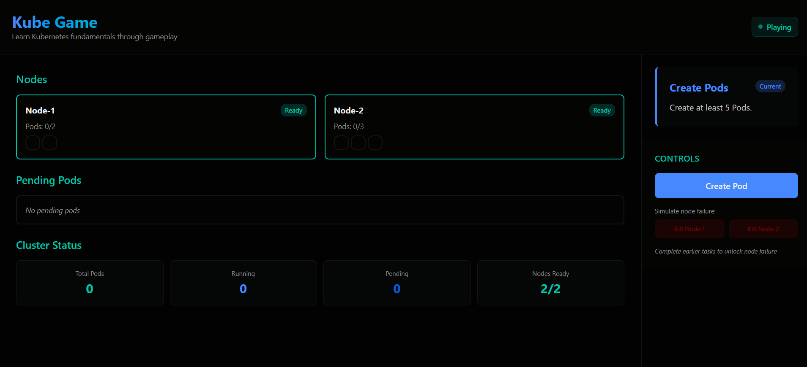
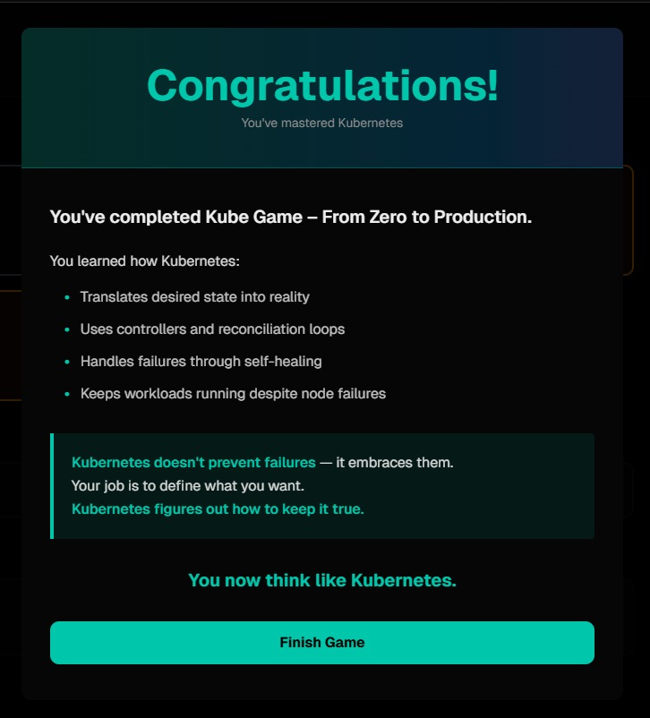

# 🎮 Kube Game

A short preview of the gameplay:



👉 **Play the game:**  [https://game.kubelab.com.br](https://game.kubelab.com.br)

**Kube Game** is an interactive learning game designed to teach **Kubernetes fundamentals through gameplay**, not tutorials.

Instead of reading YAML files or documentation, you *play as Kubernetes* — observing the cluster, defining desired state, and understanding how the system reacts to failures.

## 🧠 What is the idea?

Kubernetes is not about *doing things manually*.  
It’s about **declaring what you want** and letting the system continuously reconcile reality.

Kube Game makes this behavior **visual, explicit, and intuitive**.

You don’t manage pods directly.  
You **define intent** — and watch Kubernetes do the work.

## 🕹️ How the game works

The game is divided into **phases**, each introducing a core Kubernetes concept.

Each phase:

- Starts with a **fresh isolated scenario**
- Presents **guided tasks** (goals) on the right panel
- Requires the player to execute a specific **action**
- Explains *why* Kubernetes behaves the way it does
- Only advances after the explanation is acknowledged

This guarantees learning happens **step by step**, without skipping concepts.

## 📚 Game Phases

### Phase 1 — Core Objects

Learn the basics:

- Pods
- Nodes
- Scheduling
- What happens when resources are created

---

### Phase 2 — Desired State

Understand the most important Kubernetes concept:

- Desired vs Current state
- Why Kubernetes reacts *after* you declare intent
- Why nothing happens if the state already matches

---

### Phase 3 — Controllers

Discover how Kubernetes actually works:

- Controllers monitor state
- Reconciliation loops
- Why Kubernetes is always “watching”

---

### Phase 4 — Failure & Recovery

Learn failure as a feature:

- Pods being deleted
- Controllers recreating resources
- Why manual actions don’t last

---

### Phase 5 — Self-Healing

See Kubernetes in action:

- Node failures
- Pod rescheduling
- Workloads surviving infrastructure problems

This is where everything clicks.

## 🏁 Game Completion

After finishing Phase 5, the game shows a **final completion message**, reinforcing the key takeaway:

> Kubernetes doesn’t prevent failures — it embraces them.  
> You define *what you want*.  
> Kubernetes ensures it stays true.



## 🚀 Tech Stack

- React + TypeScript
- Vite
- Tailwind CSS
- Custom game engine (state + reconciliation loop)

## 🎯 Goal of the project

This is **not** a Kubernetes simulator.  
It’s a **mental model builder**.

The goal is to help developers:

- Think in terms of desired state
- Understand reconciliation
- Stop fighting Kubernetes behavior
- Start designing systems the Kubernetes way

## 📌 Status

🚧 Actively evolving  
New mechanics and learning experiences may be added over time.

---

## 🚀 Running the Game Locally

```bash
npm install
npm run dev
```

The game will be available at:

[http://localhost:5173](http://localhost:5173)
